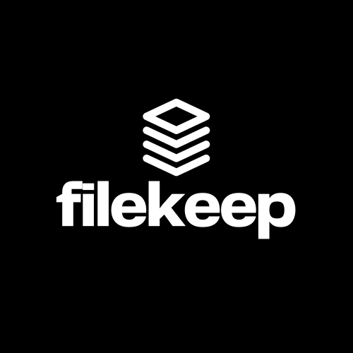

# 📁 FileKeep — A Dropbox Clone



FileKeep is a Dropbox clone built as a solution to the [John Cricket Coding Challenge: Build Your Own Dropbox](https://codingchallenges.fyi/challenges/challenge-dropbox). It provides a clean, modern, and fast file storage interface built with React, TypeScript, and Vite — and powered by Docker for easy setup and deployment.

## 🚀 Features

- 📂 Upload, download, and organize files in folders
- 🔗 Share files and folders via links
- 🔄 Sync local folders with your FileKeep account
- ☁️ Cloud storage backend (S3-compatible)
- ⚙️ Fully containerized with Docker and Docker Compose

## 🛠️ Tech Stack

- **Frontend**: React + TypeScript + Vite
- **Filekeep Api**: Java Spring Boot
- **Sync Application**: Ruby + Rack
- **Containerization**: Docker & Docker Compose
- **Cloud storage**: AWS S3 or compatible service

## 📦 Getting Started

### ⚠️ Start the API and Sync Service First

Before running the client, make sure the [FileKeep API](https://github.com/jayastronomic/filekeep-api) and the [Filekeep Sync Service](https://github.com/jayastronomic/filekeep-sync-service) is up and running.

The frontend depends on the backend to fetch files, folders, and perform other operations and also depends the synce service to sync local files to the remote api.

### Prerequisites

Make sure you have the following installed:

- [Docker](https://www.docker.com/)

### Clone the Repo

```bash
git clone https://github.com/jayastronomic/filekeep-client
cd filekeep-client
```

### Add a .env file to the repo with the following environment variables:

```
VITE_BACKEND_URL=http://localhost:8080
VITE_HOST_URL=http://localhost:5173
```

### Build the image & Start the container

```bash
docker-compose up --build
```

## 📚 Challenge Context

This project is built as a solution to the **Build Your Own Dropbox** challenge by [John Cricket](https://codingchallenges.fyi/challenges/challenge-dropbox). The challenge involves:

> Building a simplified version of Dropbox that supports file uploads, downloads, folder management, and link sharing — optionally including syncing capabilities with a local folder.

## 📌 Objectives

- Add user authentication
- Implement folder creation
- Implement file upload capabalities
- Allow files to be shared via shareable link
- Create local folder sync background service
- Make the UI mobile responsive

## 🤝 Contributing

Pull requests are welcome! For major changes, please open an issue first to discuss what you’d like to change.

## 📄 License

This project is open-source and available under the [MIT License](LICENSE).
